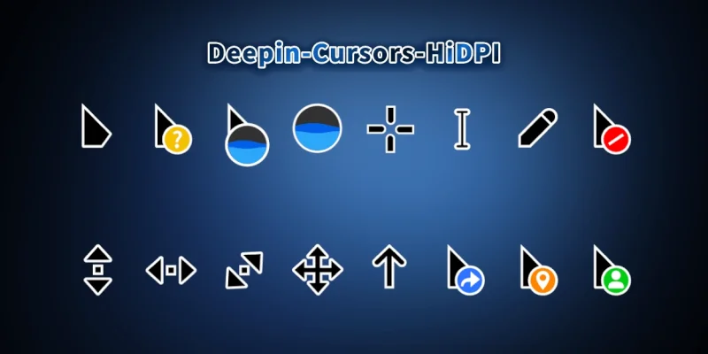

# Deepin-Cursors-HiDPI

一款仿 Deepin 系统风格的鼠标光标主题

* 适配高分屏，最高128px

## 如何使用？

1. 去 [releases](https://github.com/Xuaner183/Deepin-Cursors-HiDPI/releases/latest "点击下载") 下载
2. 解压
3. 右键 `.inf` 文件选择 `安装`

## 仓库地址

* [GitHub](https://github.com/Xuaner183/Deepin-Cursors-HiDPI "主仓库")
* [GitCode](https://gitcode.com/Xuan_er123/Deepin-Cursors-HiDPI "镜像仓库")

## 预览图

